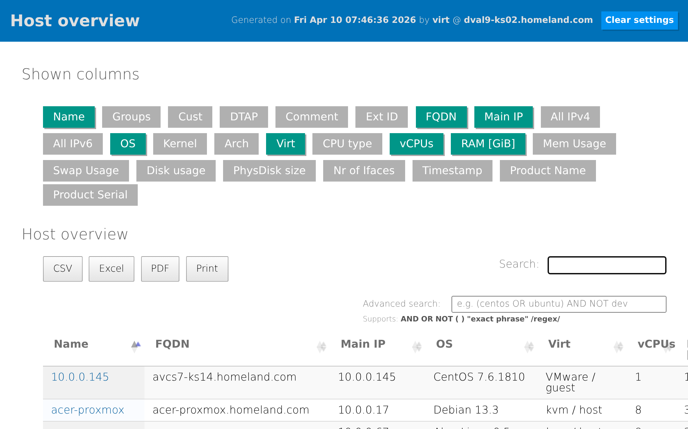

Ansible Configuration Management Database
=========================================


About
-----

Ansible-cmdb takes the output of Ansible's fact gathering and converts it into
a static HTML overview page (and other things) containing system configuration
information.

It supports multiple types of output (html, csv, sql, etc) and extending
information gathered by Ansible with custom data. For each host it also shows
the groups, host variables, custom variables and machine-local facts.




[HTML example](https://rawgit.com/fboender/ansible-cmdb/master/example/html_fancy.html) output.


Features
--------

(Not all features are supported by all templates)

* Multiple formats / templates:
    * Fancy HTML (`--template html_fancy`), as seen in the screenshots above.
    * Fancy HTML Split (`--template html_fancy_split`), with each host's details
      in a separate file (for large number of hosts).
    * CSV (`--template csv`), the trustworthy and flexible comma-separated format.
    * JSON (`--template json`), a dump of all facts in JSON format.
    * Markdown (`--template markdown`), useful for copy-pasting into Wiki's and
      such.
    * Markdown Split (`--template markdown_split`), with each host's details
      in a seperate file (for large number of hosts).
    * SQL (`--template sql`), for importing host facts into a (My)SQL database.
    * Plain Text table (`--template txt_table`), for the console gurus.
    * and of course, any custom template you're willing to make.
* Export displayed/filtered data as CSV, Excel (.xlsx), or PDF directly from
  the browser. A Print button is also available. Exports respect column
  visibility and active search filters.
* Advanced search with support for logical operators (`AND`, `OR`, `NOT`),
  parenthetical grouping, `"quoted phrases"`, and `/regex/` patterns. Works
  alongside the default search box. See [Advanced Search](#advanced-search)
  below for details.
* Stale-page detection: generated pages auto-refresh after 12 hours via a
  `<meta refresh>` tag, and a banner appears when a user returns to a tab
  older than 12 hours. See [Stale page handling](#stale-page-handling) below.
* Host overview and detailed host information.
* Host and group variables.
* Gathered host facts and manual custom facts.
* Adding and extending facts of existing hosts and manually adding entirely
  new hosts.
* Custom columns


Getting started
---------------

Links to the full documentation can be found below, but here's a rough
indication of how Ansible-cmdb works to give you an idea:

1. Install Ansible-cmdb from [source, a release
   package](https://github.com/fboender/ansible-cmdb/releases) or through pip: `pip
   install ansible-cmdb`.

1. Fetch your host's facts through ansible:

        $ mkdir out
        $ ansible -m setup --tree out/ all

1. Generate the CMDB HTML with Ansible-cmdb:

        $ ansible-cmdb out/ > overview.html

1. Open `overview.html` in your browser.

That's it! Please do read the full documentation on usage, as there are some
caveats to how you can use the generated HTML.

Documentation
-------------

All documentation can be viewed at [readthedocs.io](http://ansible-cmdb.readthedocs.io/en/latest/).

* [Full documentation](http://ansible-cmdb.readthedocs.io/en/latest/)
* [Requirements and installation](http://ansible-cmdb.readthedocs.io/en/latest/installation/)
* [Usage](http://ansible-cmdb.readthedocs.io/en/latest/usage/)
* [Contributing and development](http://ansible-cmdb.readthedocs.io/en/latest/dev/)


Advanced Search
---------------

The HTML templates include an **Advanced search** box below the default search
box. Both work together — the default search filters first, then the advanced
filter applies on top.

### Syntax

| Syntax | Example | Description |
|--------|---------|-------------|
| Plain terms | `centos prod` | Implicit AND — all terms must match (same as default search) |
| AND | `centos AND prod` | Explicit AND |
| OR | `centos OR ubuntu` | Either term matches |
| NOT | `NOT windows` | Exclude matching rows |
| Grouping | `(centos OR ubuntu) AND prod` | Parenthetical precedence |
| Quoted phrase | `"Red Hat"` | Exact phrase match |
| Regex | `/^192\.168\./` | Regular expression (case-insensitive) |
| Regex (alt) | `regex:^192\.168\.` | Alternate regex syntax |

Operators `AND`, `OR`, and `NOT` are case-insensitive.

### URL sharing

Advanced search terms are shareable via the `?adv=` query parameter, similar to
the default search's `?search=` parameter. Both can be combined:

    http://host:3000/?search=prod&adv=(centos OR ubuntu) AND NOT dev


Stale page handling
-------------------

When ansible-cmdb pages are regenerated on a schedule (e.g. via cron), users
who leave the page open in a tab or return to a bookmarked URL can end up
looking at stale data without realizing it. The generated HTML includes two
client-side safeguards to reduce this:

1. **`<meta http-equiv="refresh" content="43200">`** — a tab left open will
   reload itself automatically after 12 hours.
2. **Stale banner** — a small script embedded in the page records the
   generation time at render. On `DOMContentLoaded` and whenever the tab
   regains focus (`visibilitychange`), it compares the current time to the
   generation time. If the age is ≥ 12 hours, a yellow banner appears at the
   top of the page with a "Reload now" link. Fresh pages show no banner.

The timestamp in the page header is rendered in **UTC** so it's unambiguous
regardless of the viewer's timezone.

### Serving ansible-cmdb behind Apache

If you serve the generated pages over HTTP (e.g. with Apache 2.4), you can
also set HTTP-level cache headers so the browser itself will not serve a copy
older than 12 hours without revalidating with the server. Add this to your
vhost or `<Directory>` block (requires `mod_headers` and `mod_expires`, both
enabled by default on RHEL-family distributions):

```apache
<Directory "/var/www/html/ansible-cmdb">
    <FilesMatch "\.html$">
        Header set Cache-Control "max-age=43200, must-revalidate, public"
        ExpiresActive On
        ExpiresDefault "access plus 12 hours"
    </FilesMatch>
</Directory>
```

After 12 hours the browser sends a conditional `If-Modified-Since` request;
Apache answers `304 Not Modified` if the file is unchanged, or `200` with
the new content. Scoping to `\.html$` leaves the `static/` JS and CSS
assets with their normal caching behavior.


License
-------

Ansible-cmdb is licensed under the GPLv3:

    This program is free software: you can redistribute it and/or modify
    it under the terms of the GNU General Public License as published by
    the Free Software Foundation, either version 3 of the License, or
    (at your option) any later version.

    This program is distributed in the hope that it will be useful,
    but WITHOUT ANY WARRANTY; without even the implied warranty of
    MERCHANTABILITY or FITNESS FOR A PARTICULAR PURPOSE.  See the
    GNU General Public License for more details.

    You should have received a copy of the GNU General Public License
    along with this program.  If not, see <http://www.gnu.org/licenses/>.

    For the full license, see the LICENSE file.
